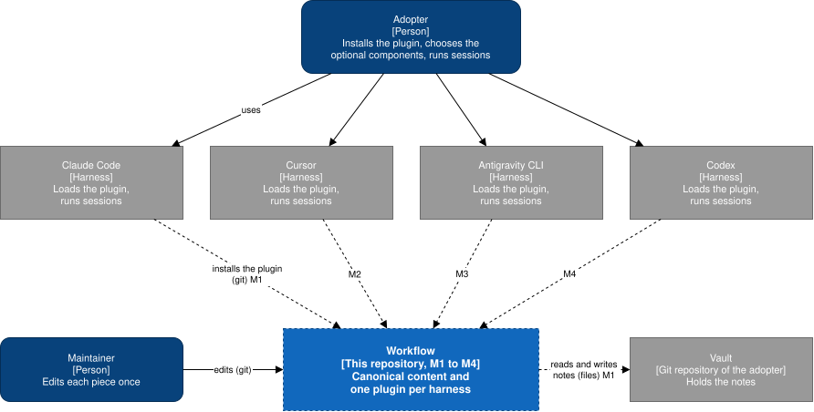

# Architecture

## Goal

Deliver one workflow — a contract, skills, commands, a verifier, a memory layer, and a status line — as
an installable plugin in four agent harnesses, from content written once.

The quality goals are the [non-functional requirements](../requirements/non-functional/README.md). Three
shape the architecture most: one authored copy per piece
([NFR-MNT-01](../requirements/non-functional/maintainability.md#nfr-mnt-01)), canonical content that
names no harness ([NFR-FLEX-06](../requirements/non-functional/flexibility.md#nfr-flex-06)), and the same
behavior on three operating systems
([NFR-FLEX-05](../requirements/non-functional/flexibility.md#nfr-flex-05)).

## Constraints

The [constraints](../requirements/overview.md#constraints) of the SRS.

## Context and scope

Dashed elements are not built yet; each carries the milestone that builds it.

| Element | Kind | What flows | Milestone |
| --- | --- | --- | --- |
| Adopter | Person | Installs the plugin in a harness, chooses the optional components, runs sessions | M1 |
| Maintainer | Person | Edits each piece once, in this repository, through git | M1 |
| Claude Code | External harness | Installs the plugin from this repository and loads it in every session | M1 |
| Cursor | External harness | Same as Claude Code | M2 |
| Antigravity CLI | External harness | Same as Claude Code | M3 |
| Codex | External harness | Same as Claude Code | M4 |
| Vault | External git repository of the adopter | The plugin's memory functions read and write its notes as files | M1 |

## Solution strategy

Decided:

- Every script is Python 3.10 or newer, so each one has a single copy for the three operating systems.

- The canonical content is rendered into one plugin per harness by a build, and the generated plugin is
  committed ([ADR 0001](../decisions/0001-canonical-content-rendered-into-one-plugin-per-harness.md)).

## Sections

| Section | Where |
| --- | --- |
| Building blocks | [building-blocks/](building-blocks/README.md) |
| Runtime | [runtime/](runtime/README.md) |
| Deployment | [deployment.md](deployment.md) |
| Decisions | [../decisions/](../decisions/README.md) |
| Glossary | The [glossary](../requirements/glossary.md) of the SRS |

Not written yet:

- **Crosscutting concepts.** The first ones — how an optional component is turned on or off, and
  security — arrive with the spec of epic #2.
- **Risks.** The known ones are the [open questions](../requirements/open-questions.md) of the SRS.
