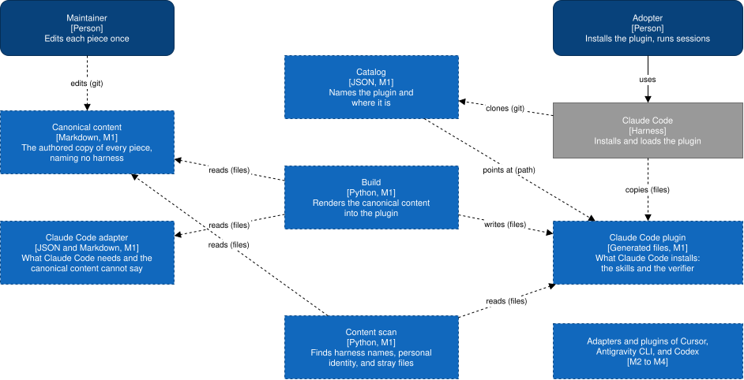

# Building blocks

Dashed elements are not built yet; each carries the milestone that builds it.

| Block | Technology | Responsibility | Talks to | Milestone |
| --- | --- | --- | --- | --- |
| [Canonical content](canonical-content.md) (`canonical/`) | Markdown | The authored copy of every piece, naming no harness | — | M1 |
| [Claude Code adapter](claude-code-adapter.md) (`adapters/claude-code/`) | JSON, Markdown | What Claude Code needs and the canonical content cannot say: the manifest, the frontmatter additions, the terms | — | M1 |
| [Build](build.md) (`build.py`, `builder/`) | Python | Renders the canonical content into the plugin, and checks that the committed plugin matches | Canonical content, adapter, plugin (files) | M1 |
| Content scan (`scan.py`) | Python | Finds harness names in the canonical content, personal identity in the plugin, and tracked environment files and vault notes | Canonical content, plugin (files) | M1 |
| [Claude Code plugin](claude-code-plugin.md) (`plugins/claude-code/`) | Generated files | What Claude Code installs | — | M1 |
| [Catalog](catalog.md) (`.claude-plugin/marketplace.json`) | JSON | Names the plugin and where it is in the repository | Plugin (path) | M1 |
| Adapters and plugins of Cursor, Antigravity CLI, and Codex | Per harness | The same two blocks for each later harness | — | M2 to M4 |

Why the blocks are split this way is
[ADR 0001](../../decisions/0001-canonical-content-rendered-into-one-plugin-per-harness.md).

Not written yet:

- **The file of the content scan.** [#9](https://github.com/ATNexusLab/workflow/issues/9) writes it with
  the scan.
- **The blocks of the contract, the memory layer, and the status line.** Each is added by the spec of its
  epic.
