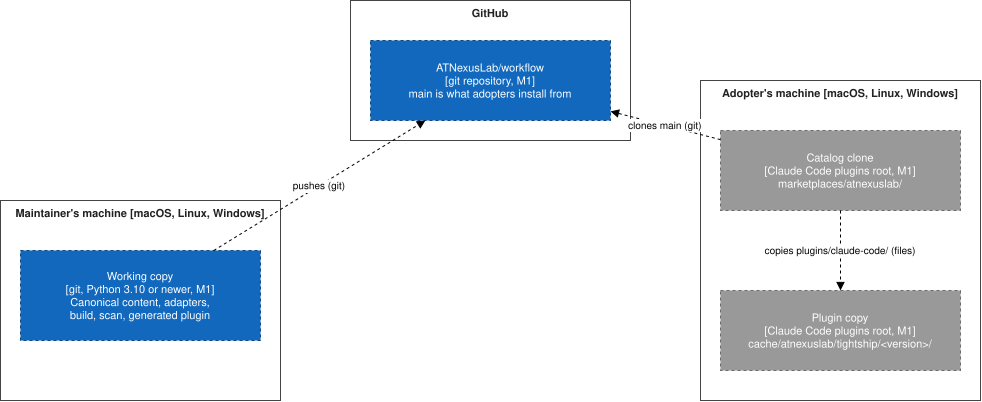

# Deployment

Dashed elements are not built yet; each carries the milestone that builds it.

## Where each block runs

| Environment | Holds | Milestone |
| --- | --- | --- |
| The maintainer's machine | The working copy: every block of the [building blocks](building-blocks/README.md). The build and the scans run here, with Python 3.10 or newer | M1 |
| GitHub, `ATNexusLab/workflow` | The repository. `main` is the branch adopters install from | M1 |
| The adopter's machine | Claude Code's plugins root: a clone of the repository as the catalog, and a copy of `plugins/claude-code/` as the installed plugin | M1 |

## Packaging and installation

The plugin is a directory of the repository, `plugins/claude-code/`. Claude Code installs it by cloning
the repository as a catalog and copying that directory, as described in
[An adopter installs the plugin](runtime/install.md). Nothing is built or run on the adopter's machine.

## Delivery

- The gates run on the maintainer's machine before each commit. The repository has no CI.
- A pull request merges an epic's branch into `develop`.
- A release is a merge commit from `develop` into `main`. Its version policy is decided by epic #5.
- The docs site is never deployed.
