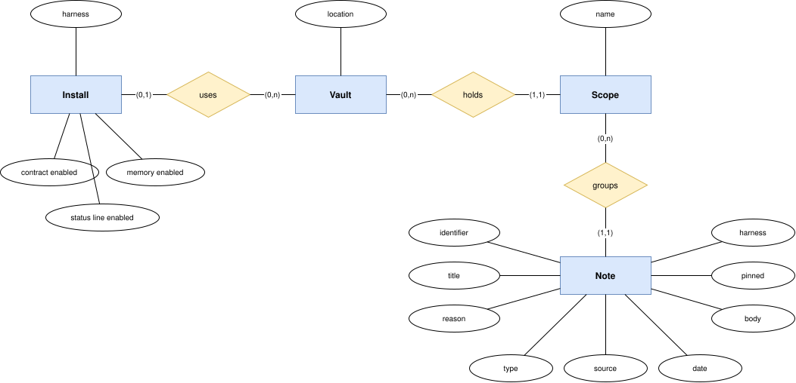

# Data model

The product has no database. Its data is files on the adopter's machine: the notes of a vault, and the
choices the adopter made when installing a harness plugin.

## Conceptual model

| Entity | Meaning | Milestone |
| --- | --- | --- |
| Install | One harness plugin installed on a machine, with the state of each optional component | M1 |
| Vault | The adopter's repository of notes, at a location the adopter chose | M1 |
| Scope | A group of notes in a vault: one per project, plus the shared scope | M1 |
| Note | One durable fact, with the reason it exists | M1 |

An install uses no vault while memory is disabled. One vault serves the installs of every harness on the
machine ([NFR-COMP-02](../requirements/non-functional/compatibility.md#nfr-comp-02)).

## Not written yet

The access patterns, the logical model of each entity, and the storage are defined by the M1 specs for
memory and installation.
